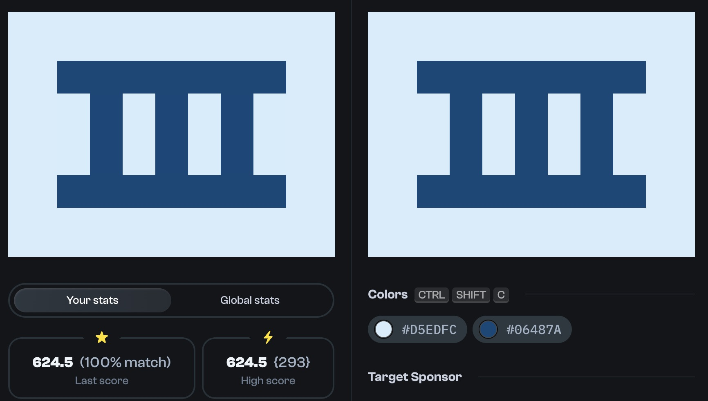

# Daily Targets - 01/02/2024



---

**remark**: *my first solution was based on the div and the ::after element using box-shadow(s) to create the pattern. Then i saw a solution using border-block and learned something new*

---

```html
<div></div>
<style>
  body {
    background: #D5EDFC;
  }
  div {
    position: absolute;
    top: 60px;
    left: 60px;
    width: 280px;
    height: 100px;
    border-block: 40px solid #06487A;
    background: repeating-linear-gradient(90deg, #D5EDFC 0 40px, #06487A 40px 80px);
  }
</style>
```
