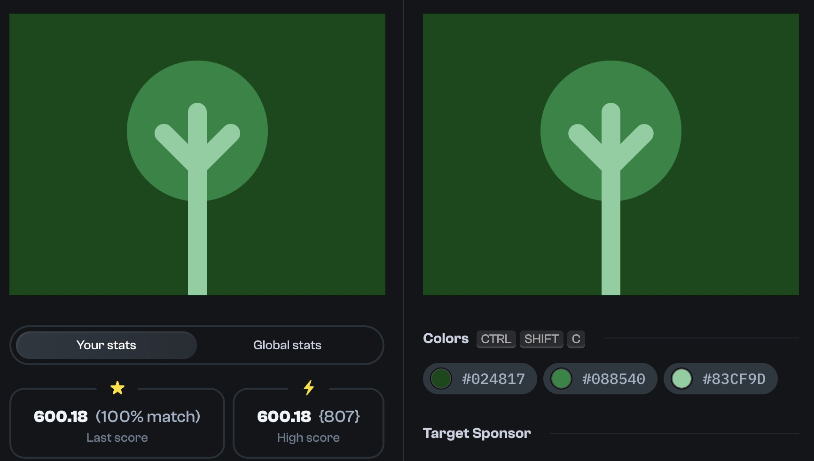

# Daily Targets - 22/01/2024



```html
<div leafs/><div tree/>
<style>
  body {
    background: #024817;
  }
  div[tree] {
    position: absolute;
    top: 45px;
    left: calc(50% - 10px);
    width: 20px;
    height: 205px;
    border-radius: 20px 20px 0 0;
    background: #83CF9D;
  }
  div[tree]::before, div[tree]::after {
    content: '';
    position: absolute;
    width: 64px;
    height: 20px;
    top: 38px;
    background: #83CF9D;
  }
  div[tree]::before {
    left: -42px;
    transform: rotate(45deg);
    border-radius: 20px 0 0 20px;
  }
  div[tree]::after {
    left: -2px;
    transform: rotate(-45deg);
    border-radius: 0 20px 20px 0;
  }
  div[leafs] {
    position: absolute;
    top: calc(50% - 100px);
    left: calc(50% - 75px);
    width: 150px;
    height: 150px;
    border-radius: 50%;
    background: #088540;
  }