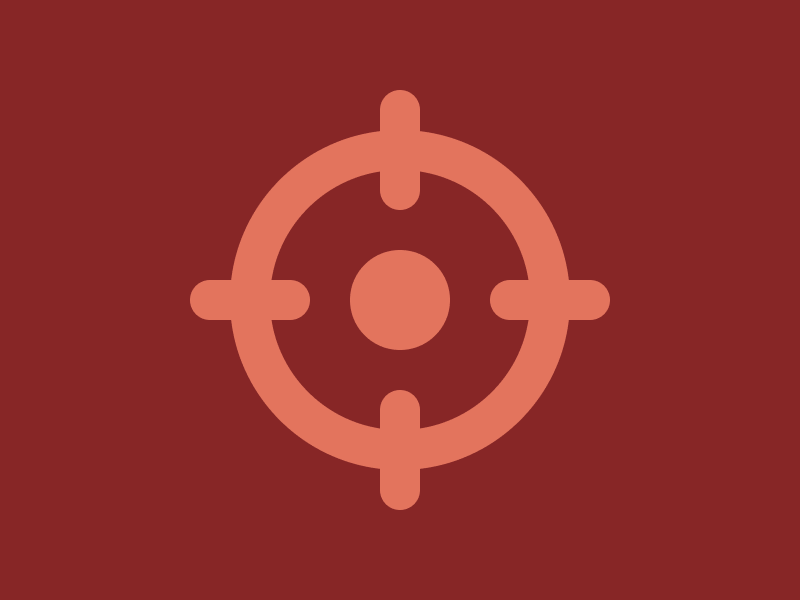

# Daily Targets - 29/10/2023



```html
<div class=container>
  <div class=line></div>
  <div class=line></div>
  <div class=line></div>
  <div class=line></div>
</div>
<style>
  body {
    display: grid;
    place-items: center;
    background-color: #872626;
  }
  div.container {
    position: relative;
    border: 20px solid #E3745D;
    border-radius: 50%;
    width: 130px;
    aspect-ratio: 1/1;
  }
  div.container::after {
    content: "";
    position: absolute;
    top: 50%;
    left: 50%;
    transform: translate(-50%, -50%);
    border-radius: 50%;
    width: 50px;
    aspect-ratio: 1/1;
    background-color: #E3745D;
  }
  div.line {
    position: absolute;
    border-radius: 27%;
    width: 20px;
    aspect-ratio: 1/3;
    background-color: #E3745D;
  }
  div.line:nth-child(1) {
    top: 0;
    left: 50%;
    transform: translate(-50%, calc(-50% - 10px));
  }
  div.line:nth-child(2) {
    top: 50%;
    left: 0;
    transform: translate(calc(-50% - 10px), -50%) rotate(90deg);
  }
  div.line:nth-child(3) {
    bottom: 0;
    left: 50%;
    transform: translate(-50%, calc(50% + 10px));
  }
  div.line:nth-child(4) {
    top: 50%;
    right: 0;
    transform: translate(calc(50% + 10px), -50%) rotate(90deg);
  }
</style>