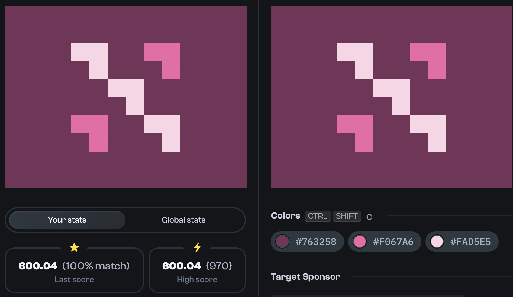

# Daily Targets - 31/10/2023



```html
<div class=container>
  <div></div>
  <div></div>
  <div></div>
  <div></div>
  <div></div>
</div>
<style>
  body {
    background: #763258;
    display: grid;
    place-items: center;
  }
  div.container {
    display: grid;
    place-items: center;
    grid-template-areas: "one . two" ". three ." "four . five"
  }
  div.container > div {
    width: 60px;
    aspect-ratio: 1/1;
  }
  div.container > div:nth-child(odd) {
    background: conic-gradient(#FAD5E5 180deg, transparent 180deg 270deg, #FAD5E5 90deg);
  }
  div.container > div:nth-child(even) {
    background: conic-gradient(#F067A6 180deg, transparent 180deg 270deg, #F067A6 90deg);
  }
  div.container > div:nth-child(1) {
    grid-area: one;
  }
  div.container > div:nth-child(2) {
    grid-area: two;
  }
  div.container > div:nth-child(3) {
    grid-area: three;
  }
  div.container > div:nth-child(4) {
    grid-area: four;
  }
  div.container > div:nth-child(5) {
    grid-area: five;
  }
</style>